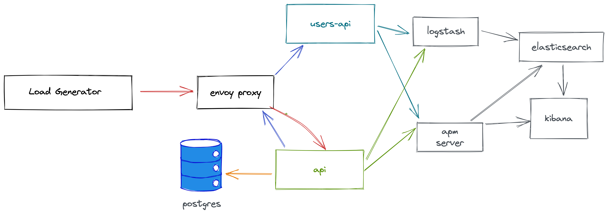

# SRE Lab

## Setup

### Docker compose

```
docker compose up -d
```

- The following ports need to be available:
  - 5432 (postgres)
  - 8080 (dropwizard api)
  - 8081 (dropwizard api admin)
  - 9200 (elasticsearch)
  - 5601 (kibana)
  - 8200 (apm server)
  - 8125 (StatsD via metricbeat)
  - 12201 (logstash)
  - 9996 (users api)

View Elastic APM: [http://localhost:5601/app/apm/services](http://localhost:5601/app/apm/services)


`###  K8s
Requirements:  
Kubernetes version >= 1.21  
Helm version >= 3.8

```
./build-containers.sh
./k8s-bootstrap.sh
```

SigNoz APM available at [http://127.0.0.1:3301/login](http://127.0.0.1:3301/login)

Create a new user and login.


### About
This lab contains the following components:
- Kotlin Dropwizard API (orders-api)
- Golang API (users-api)
- Postgres DB
- K6 load generation
- Service Mesh (envoy/istio)
- Observability tools
    - Elastic
    - SigNoz

### Current Topology




## TODO
- [x] Create K8s configs
- [ ] Control plane (istio)
- [ ] Message bus for triggering changes in state
- [ ] Mechanism for triggering load tests
- [ ] interface for scenarios
- [ ] ability to reset
- [ ] Add support for multiple APMs
  - [x] Elastic
  - [x] SigNoz
  - [ ] Datadog
  - [ ] New Relic
  - [ ] Automation to toggle between observability tools
 - [ ] Experiment with [Coroot](https://github.com/coroot/coroot)